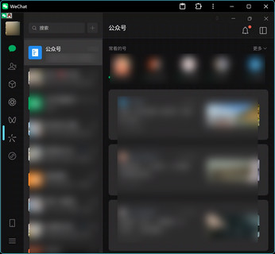
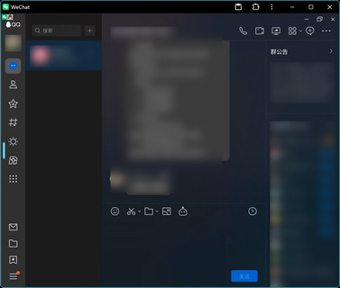

# WeChat Selkies

[](https://github.com/nickrunning/wechat-selkies/stargazers)
[](https://github.com/nickrunning/wechat-selkies/network/members)
[](https://github.com/nickrunning/wechat-selkies/issues)
[](https://github.com/nickrunning/wechat-selkies/blob/master/LICENSE)
[](https://hub.docker.com/r/nickrunning/wechat-selkies)
[](https://hub.docker.com/r/nickrunning/wechat-selkies)
[](https://github.com/nickrunning/wechat-selkies/releases)
[](https://github.com/nickrunning/wechat-selkies/actions)
[](https://github.com/nickrunning/wechat-selkies/commits)

English | [中文](README.md)

Docker-based WeChat/QQ Linux client with browser access support using Selkies WebRTC technology.

## Project Overview

This project packages the official WeChat/QQ Linux client in a Docker container, enabling direct WeChat/QQ usage in browsers through Selkies technology without local installation. Suitable for server deployment, remote work, and other scenarios.

## Upgrade Notes

> If some features are missing after an upgrade, please clear the `openbox` directory in the local mounted directory (e.g., `./config/.config/openbox`).

## Features

- 🌐 **Browser Access**: Use WeChat directly through web browsers without local installation
- 🐳 **Dockerized Deployment**: Simple containerized deployment with environment isolation
- 🔒 **Data Persistence**: Supports persistent storage of configurations and chat records
- 🎨 **Chinese Support**: Complete Chinese fonts and localization support, including local Chinese input methods
- 🖼️ **Image Copy**: Support image copying through sidebar panel
- 📁 **File Transfer**: Support file transfer through sidebar panel
- 🖥️ **AMD64 and ARM64 Architecture Support**: Compatible with mainstream CPU architectures
- 🔧 **Hardware Acceleration**: Optional GPU hardware acceleration support
- 🪟 **Window Switcher**: Added a floating window switcher in the top left corner for easy switching to background windows, laying the foundation for adding other features in the future

## Screenshots



## Quick Start

### Requirements

- Docker
- Docker Compose
- Modern browser with WebRTC support (Chrome, Firefox, Safari, etc.)

### Quick Deployment

1. **Direct deployment using pre-built images**
GitHub Container Registry image:
```bash
docker run -it -p 3001:3001 -v ./config:/config --device /dev/dri:/dev/dri ghcr.io/nickrunning/wechat-selkies:latest
```
Docker Hub image:
```bash
docker run -it -p 3001:3001 -v ./config:/config --device /dev/dri:/dev/dri nickrunning/wechat-selkies:latest
```

2. **Access WeChat**
   
   Open in browser: `https://localhost:3001` or `https://<server-ip>:3001`
   > **Note**: 3001 port is for HTTPS access. If you need HTTP access, please map port 3000 as well.

### docker-compose Deployment
1. **Create project directory and navigate into it**
   ```bash
   mkdir wechat-selkies
   cd wechat-selkies
   ```
2. **Create `docker-compose.yml` file with the following content**
   ```yaml
    services:
      wechat-selkies:
        image: nickrunning/wechat-selkies:latest    # or ghcr.io/nickrunning/wechat-selkies:latest
        container_name: wechat-selkies
        ports:
          - "3000:3000"       # http port
          - "3001:3001"       # https port
        restart: unless-stopped
        volumes:
          - ./config:/config
        devices:
          - /dev/dri:/dev/dri # optional, for hardware acceleration
        environment:
          - PUID=1000                    # user ID
          - PGID=100                     # group ID
          - TZ=Asia/Shanghai             # timezone
          - LC_ALL=zh_CN.UTF-8           # locale
          - AUTO_START_WECHAT=true       # default is true
          - AUTO_START_QQ=false          # default is false
          # - CUSTOM_USER=<Your Name>      # recommended to set a custom user name
          # - PASSWORD=<Your Password>     # recommended to set a password for selkies web ui
    ```
3. **Start the service**
   ```bash
   docker-compose up -d
   ```

### Source Code Deployment

1. **Clone the repository**
   ```bash
   git clone https://github.com/nickrunning/wechat-selkies.git
   cd wechat-selkies
   ```

2. **Start the service**
   ```bash
   docker-compose up -d
   ```

3. **Access WeChat**

   Open in browser: `https://localhost:3001` or `https://<server-ip>:3001`

### Configuration

For more custom configurations, please refer to [Selkies Base Images from LinuxServer](https://github.com/linuxserver/docker-baseimage-selkies).

#### Docker Hub Push Configuration
This project supports pushing to both GitHub Container Registry and Docker Hub. Docker Hub push is optional and requires manual configuration. Please add the following Environment Secrets and Environment Variables in your repository to enable Docker Hub push functionality:

**Environment Secrets:**
* `DOCKERHUB_USERNAME`: Your Docker Hub username
* `DOCKERHUB_TOKEN`: Your Docker Hub Access Token

**Environment Variables:**
* `ENABLE_DOCKERHUB`: Set to `true` to enable Docker Hub push

#### Environment Variables

Configure the following environment variables in `docker-compose.yml`:

| Variable | Default | Description |
|----------|---------|-------------|
| `TITLE` | `WeChat Selkies` | Web UI title |
| `PUID` | `1000` | User ID |
| `PGID` | `100` | Group ID |
| `TZ` | `Asia/Shanghai` | Timezone setting |
| `LC_ALL` | `zh_CN.UTF-8` | Locale setting |
| `CUSTOM_USER` | - | Custom username (recommended) |
| `PASSWORD` | - | Web UI access password (recommended) |
| `AUTO_START_WECHAT` | `true` | Whether to automatically start the WeChat client |
| `AUTO_START_QQ` | `false` | Whether to automatically start the QQ client |

#### Port Configuration

- `3001`: Web UI access port

#### Volume Mounts

- `./config:/config`: WeChat configuration and data persistence directory

> **Note:** If the right-click menu lacks `WeChat` related options after an upgrade, please clear the `openbox` directory in the local mounted directory (e.g., `./config/.config/openbox`).

## Advanced Configuration

### Hardware Acceleration

If your system supports GPU hardware acceleration, the Docker Compose configuration includes relevant device mapping:

```yaml
devices:
  - /dev/dri:/dev/dri
```

## Directory Structure

```
wechat-selkies/
├── docker-compose.yml          # Docker Compose configuration file
├── Dockerfile                  # Docker image build file
├── LICENSE                     # License
├── README.md                   # Project documentation (Chinese)
├── README_en.md                # Project documentation (English)
├── config/                     # Configuration and data persistence directory
└── root/                       # Container initialization files
    ├── defaults/
    │   └── autostart           # Auto-start configuration
    └── wechat.png              # WeChat icon
```

## Troubleshooting

### Common Issues

1. **Unable to access Web UI**
   - Check if port 3001 is occupied
   - Confirm Docker container is running normally: `docker ps`

### Log Viewing

View container runtime logs:
```bash
docker-compose logs -f wechat-selkies
```

## Technical Architecture

- **Base Image**: `ghcr.io/linuxserver/baseimage-selkies:ubuntunoble`
- **WeChat Client**: Official WeChat Linux version
- **Web Technology**: Selkies WebRTC
- **Containerization**: Docker + Docker Compose

## Contributing

Issues and Pull Requests are welcome!

1. Fork this project
2. Create feature branch: `git checkout -b feature/your-feature`
3. Commit changes: `git commit -am 'Add some feature'`
4. Push branch: `git push origin feature/your-feature`
5. Submit Pull Request

## License

This project is licensed under **MIT License**. See the [LICENSE](LICENSE) file for details.

### 📜 License Statement

- **Project License**: MIT License - A permissive open source license
- **Dependency Note**: This project uses [LinuxServer.io baseimage-selkies](https://github.com/linuxserver/docker-baseimage-selkies) as base image
- **License Compatibility**: Since this project only uses the base image without modifying its source code, following containerized software licensing practices, it can adopt the MIT license
- **Open Source**: Complete project source code is publicly available on GitHub: https://github.com/nickrunning/wechat-selkies

## Disclaimer and Copyright Notice

### 🚨 Important Statement

**This project has no affiliation with Tencent and is an independent third-party open source project.**

### 📋 Copyright Notice

- **WeChat®** is a registered trademark and copyrighted work of **Tencent**
- The copyright of WeChat-related icons, logos and other visual elements used in this project belongs to Tencent
- This project is for technical demonstration and learning purposes only, not for commercial use
- **In case of copyright disputes, relevant content will be removed immediately**

### ⚖️ Legal Compliance

- This project strictly complies with relevant laws, regulations and user agreements
- Users should comply with local laws and regulations when using this project
- This project assumes no legal responsibility for users' actions
- **If Tencent believes there is infringement, please contact us for immediate resolution**

### 🎯 Terms of Use

- This project is for learning, research and personal use only
- Prohibited for any commercial purposes or profit-making activities
- Users should bear the risks and legal responsibilities of use
- Please comply with WeChat user agreements and related terms of service

## Related Links

- [WeChat Official Website](https://weixin.qq.com/)
- [Selkies WebRTC](https://github.com/selkies-project)
- [LinuxServer.io](https://github.com/linuxserver)
- [xiaoheiCat/docker-wechat-sogou-pinyin](https://github.com/xiaoheiCat/docker-wechat-sogou-pinyin)

## Star History

[](https://www.star-history.com/#nickrunning/wechat-selkies&Date)